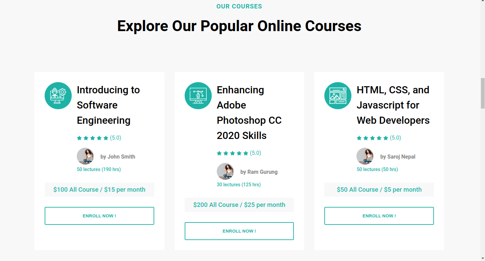
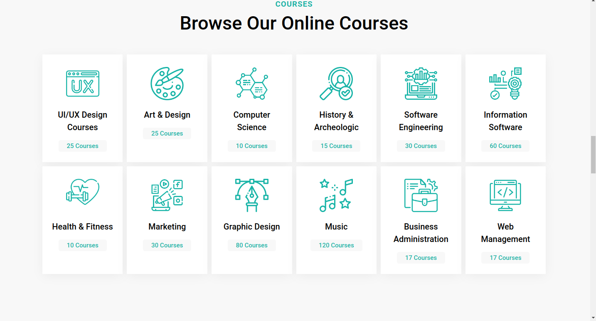
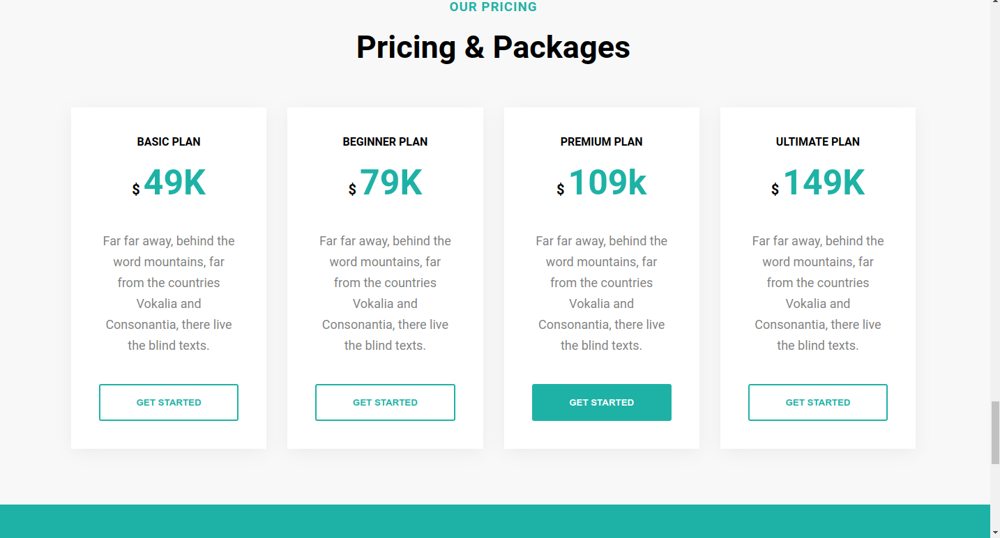

# 🎓 Academia Online Education Platform

This is a modern, responsive, and interactive online education platform built using **React**. It allows users to browse courses, enroll in classes, and complete lessons. The site is optimized for a smooth and engaging user experience on both desktop and mobile devices.

## ✨ Features

- **Browse Courses**: Explore a wide variety of courses across multiple categories.
- **Secure Learning Environment**: Complete courses with a smooth and secure multi-step learning process.
- **Responsive Design**: Optimized for all screen sizes, from mobile to desktop.

## 🛠 Technologies Used

-  **React**: JavaScript library for building user interfaces and managing application state.
-  **HTML**: For the basic structure of the platform.
-  **CSS**: For styling and making the platform visually appealing and responsive.
-  **JavaScript**: For implementing interactivity and handling logic.

## ⚙️ How It Works

1. **Browse Courses**: Users can explore featured or categorized courses on the homepage.
4. **Complete Lessons**: Go through lessons, quizzes, and course materials to complete the course.


## 📸 Screenshots






## 📦 Installation

### To run the project locally, follow these steps:

1. **Clone the repository:**
   ```bash
    https://github.com/Rukshan1999/academia.git

2. **Navigate to the project directory::**
    ```
    cd bonic-edu-platform

3. **Install dependencies:**
    ```
    npm install

4. **Run the development server:**
    ```
    npm start

## 🚀 Usage
 - Start the platform locally using the development server or deploy it using Firebase or another hosting platform.
 - Browse courses, enroll in classes, and go through lessons to complete courses.
 - Users can register and log in to track their learning progress and manage their account.

## 🎨 Customization
 - Course Data: Update the course information by editing the data/courses.js file.
 - Styling: You can customize the platform's appearance by modifying the style.css or React components' inline styles.
 - Functionality: Add or modify features by editing the components inside the src folder.

## 📝 Version
1.0.0

## License
This project is licensed under the MIT License. See the LICENSE file for more details.

## 📧 Contact
Tharindu Rukshan:
tharindurukshan709@gmail.com